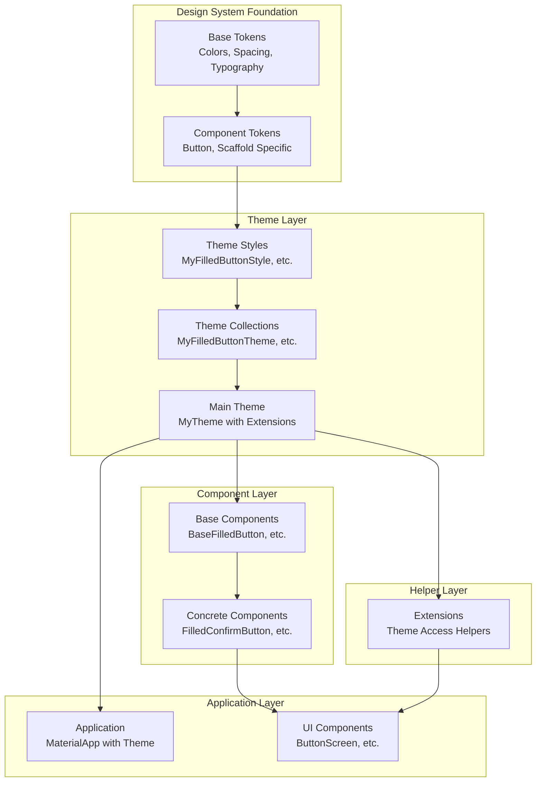
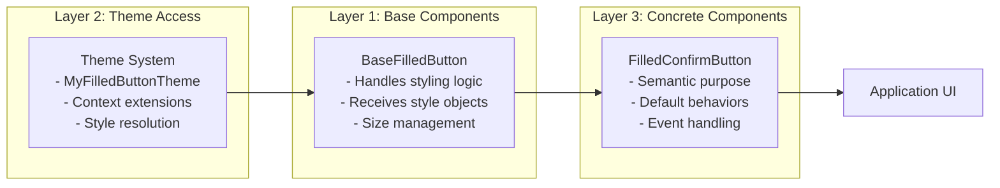

# Flutter UI Library - Token-Based Design System

A comprehensive Flutter UI library built with a sophisticated token-based design system architecture. This library demonstrates enterprise-grade component architecture with semantic naming, consistent theming, and extensible design patterns.

## Key Features

- **Token-Based Design System**: Centralized design tokens for consistent styling
- **Semantic Component Variants**: Context-aware button types (confirm, deny, destructive, etc.)
- **Three-Layer Architecture**: Base components, theme layer, and concrete implementations
- **Theme Extension Pattern**: Seamless light/dark mode support via Flutter's ThemeExtension
- **Size System**: Consistent sizing across all components (small, medium, large)
- **Type-Safe Theme Access**: Helper extensions for robust theme consumption

## Architecture Overview

This UI library implements a sophisticated three-layer architecture that separates concerns between design tokens, component styling, and implementation logic.



### Design Principles

1. **Token-First Approach**: All design decisions originate from centralized tokens
2. **Semantic Naming**: Components are named by purpose, not appearance
3. **Composition Over Inheritance**: Prefer composition and dependency injection
4. **Theme Consistency**: Single source of truth for all styling decisions
5. **Type Safety**: Leverage Dart's type system for compile-time theme validation

## Folder Structure

```
lib/
├── main.dart                          # Application entry point
├── button_screen.dart                 # Demo/showcase screen
└── src/
    ├── components/                    # Concrete UI components
    │   └── buttons/
    │       ├── filled_buttons/        # Filled button variants
    │       │   ├── filled_confirm_button.dart
    │       │   ├── filled_deny_button.dart
    │       │   ├── filled_action_cancel_button.dart
    │       │   └── filled_destructive_cancel_button.dart
    │       ├── outlined_buttons/      # Outlined button variants
    │       └── text_buttons/          # Text button variants
    ├── foundation/                    # Design system foundation
    │   ├── components/                # Base component implementations
    │   │   └── buttons/
    │   │       ├── base_filled_button.dart
    │   │       ├── base_outlined_button.dart
    │   │       └── base_text_button.dart
    │   ├── themes/                    # Theme definitions
    │   │   ├── button_theme.dart      # Button-specific themes
    │   │   └── scaffold_theme.dart    # Scaffold themes
    │   ├── tokens/                    # Design tokens
    │   │   ├── base_tokens.dart       # Core design tokens
    │   │   ├── button_tokens.dart     # Button-specific tokens
    │   │   └── scaffold_tokens.dart   # Scaffold tokens
    │   └── my_theme.dart             # Main theme orchestrator
    └── helpers/
        └── extensions.dart            # Theme access extensions
```

### Folder Responsibilities

- **`components/`**: Consumer-facing UI components with specific semantic purposes
- **`foundation/components/`**: Reusable base components that handle styling logic
- **`foundation/themes/`**: Theme definitions and style configurations
- **`foundation/tokens/`**: Raw design values and component-specific token mappings
- **`helpers/`**: Utility functions and extensions for framework integration

## Design System Foundation

### Token System Architecture

The design system implements a two-tier token architecture:

#### Base Tokens (`base_tokens.dart`)

Foundation-level design decisions that remain consistent across all themes:

```dart
class BaseTokens {
  // Color scales (blue, gray, red, green)
  static const blue500 = Color(0xFF3182CE);
  static const gray700 = Color(0xFF2D3748);

  // Spacing system (4px grid)
  static const baseUnit = 4.0;
  static const spaceMd = baseUnit * 4; // 16px

  // Typography scale
  static const fontSizeMd = 16.0;

  // Border radius scale
  static const borderRadiusMd = baseUnit * 4;
}
```

#### Component Tokens (`button_tokens.dart`, `scaffold_tokens.dart`)

Component-specific mappings that reference base tokens:

```dart
abstract class ButtonTokens {
  static const double buttonHeightMedium = 40;
  static const double buttonBorderRadiusMedium = BaseTokens.borderRadiusMd;
  static const double buttonPaddingMedium = BaseTokens.spaceMd;
  static const double fontSizeMedium = BaseTokens.fontSizeMd;
}
```

This architecture ensures:

- **Consistency**: All components derive from the same base values
- **Maintainability**: Changes to base tokens propagate automatically
- **Semantic Clarity**: Component tokens express intent, not just values

## Component Architecture

The library implements a three-layer component architecture that separates styling concerns from implementation logic:



### Layer 1: Base Components

Base components handle the complex styling logic and Flutter widget configuration:

```dart
class BaseFilledButton extends StatelessWidget {
  final MyFilledButtonStyle style;  // Injected styling
  final ButtonSize size;            // Size configuration
  final Function() onPressed;       // Behavior injection
  final String title;
  final bool isDisabled;

  @override
  Widget build(BuildContext context) {
    return FilledButton(
      style: FilledButton.styleFrom(
        backgroundColor: isDisabled
            ? style.disabledBackgroundColor
            : style.backgroundColor,
        // ... complex styling logic
      ),
      onPressed: isDisabled ? null : onPressed,
      child: // ... widget composition
    );
  }
}
```

### Layer 2: Theme System

The theme layer provides type-safe access to design decisions:

```dart
// Theme style definitions
class MyFilledButtonStyle {
  final Color backgroundColor;
  final Color textColor;
  final Color disabledBackgroundColor;
  final Color disabledTextColor;
}

// Theme collections for component variants
class MyFilledButtonTheme extends MyPrototypeButtonTheme<MyFilledButtonStyle> {
  const MyFilledButtonTheme({
    required super.confirm,      // Green confirm style
    required super.deny,         // Red deny style
    required super.actionCancel, // Gray cancel style
    required super.destructiveCancel, // Red destructive style
  });
}
```

### Layer 3: Concrete Components

Concrete components provide semantic interfaces with sensible defaults:

```dart
class FilledConfirmButton extends StatelessWidget {
  final ButtonSize size;
  final bool isDisabled;

  @override
  Widget build(BuildContext context) {
    return BaseFilledButton(
      style: context.myFilledButtonTheme.confirm, // Theme resolution
      size: size,
      isDisabled: isDisabled,
      onPressed: () => _handleConfirmAction(),
      title: 'Confirm',
    );
  }
}
```

## Button System Implementation

### Semantic Variants

The button system implements four semantic variants based on user intent:

| Variant               | Purpose                                   | Visual Treatment     |
| --------------------- | ----------------------------------------- | -------------------- |
| **Confirm**           | Positive actions (save, submit, continue) | Green primary colors |
| **Deny**              | Negative responses (no, cancel, reject)   | Red accent colors    |
| **ActionCancel**      | Neutral cancellation (back, close)        | Gray neutral colors  |
| **DestructiveCancel** | Dangerous cancellation (delete, remove)   | Red warning colors   |

### Button Types

Each semantic variant is available in three visual types:

1. **Filled**: High emphasis, primary actions
2. **Outlined**: Medium emphasis, secondary actions
3. **Text**: Low emphasis, tertiary actions

### Size System

The `ButtonSize` enum provides consistent sizing across all button types:

```dart
enum ButtonSize {
  small(height: 35, fontSize: 14, iconSize: 16),
  medium(height: 40, fontSize: 16, iconSize: 24), // Default
  large(height: 45, fontSize: 18, iconSize: 32);
}
```

## Theme System

### Theme Extension Pattern

The library leverages Flutter's `ThemeExtension` for robust theme integration:

```dart
final class MyTheme extends ThemeExtension<MyTheme> {
  final MyFilledButtonTheme myFilledButtonTheme;
  final MyOutlinedButtonTheme myOutlinedButtonTheme;
  final MyTextButtonTheme myTextButtonTheme;
  final ScaffoldTheme scaffoldTheme;

  @override
  MyTheme lerp(MyTheme? other, double t) => other ?? this;

  @override
  MyTheme copyWith({/* ... */}) => MyTheme(/* ... */);
}
```

### Light/Dark Mode Support

Themes are defined as static constants with semantic color mappings:

```dart
abstract class MyThemes {
  static const light = MyTheme(
    myFilledButtonTheme: MyFilledButtonTheme(
      confirm: MyFilledButtonStyle(
        backgroundColor: BaseTokens.green600,  // Darker green for light mode
        textColor: BaseTokens.gray100,
      ),
      // ...
    ),
  );

  static const dark = MyTheme(
    myFilledButtonTheme: MyFilledButtonTheme(
      confirm: MyFilledButtonStyle(
        backgroundColor: BaseTokens.green500,  // Lighter green for dark mode
        textColor: BaseTokens.gray900,
      ),
      // ...
    ),
  );
}
```

### Theme Access Extensions

Helper extensions provide convenient, type-safe theme access:

```dart
extension MyThemeExtension on BuildContext {
  MyFilledButtonTheme get myFilledButtonTheme =>
      Theme.of(this).extension<MyTheme>()?.myFilledButtonTheme ??
      MyThemes.light.myFilledButtonTheme;
}
```

## Adding New Components: Checkbox Example

Follow this step-by-step guide to add a new component type (checkboxes) to the design system:

### Step 1: Define Component Tokens

Create `lib/src/foundation/tokens/checkbox_tokens.dart`:

```dart
import 'package:ui_library_example/src/foundation/tokens/base_tokens.dart';

abstract class CheckboxTokens {
  // Size definitions
  static const double checkboxSizeSmall = 16;
  static const double checkboxSizeMedium = 20;
  static const double checkboxSizeLarge = 24;

  // Spacing
  static const double checkboxPaddingSmall = BaseTokens.spaceSm;
  static const double checkboxPaddingMedium = BaseTokens.spaceMd;
  static const double checkboxPaddingLarge = BaseTokens.spaceLg;

  // Border properties
  static const double checkboxBorderWidth = BaseTokens.lineWidthSm;
  static const double checkboxBorderRadius = BaseTokens.borderRadiusXs;

  // Typography
  static const double labelFontSizeSmall = BaseTokens.fontSizeSm;
  static const double labelFontSizeMedium = BaseTokens.fontSizeMd;
  static const double labelFontSizeLarge = BaseTokens.fontSizeLg;
}
```

### Step 2: Create Theme Definitions

Create `lib/src/foundation/themes/checkbox_theme.dart`:

```dart
import 'package:flutter/material.dart';
import 'package:ui_library_example/src/foundation/tokens/base_tokens.dart';
import 'package:ui_library_example/src/foundation/tokens/checkbox_tokens.dart';

// Size enum following the same pattern as buttons
enum CheckboxSize {
  small(
    size: CheckboxTokens.checkboxSizeSmall,
    padding: EdgeInsets.all(CheckboxTokens.checkboxPaddingSmall),
    labelFontSize: CheckboxTokens.labelFontSizeSmall,
  ),
  medium(
    size: CheckboxTokens.checkboxSizeMedium,
    padding: EdgeInsets.all(CheckboxTokens.checkboxPaddingMedium),
    labelFontSize: CheckboxTokens.labelFontSizeMedium,
  ),
  large(
    size: CheckboxTokens.checkboxSizeLarge,
    padding: EdgeInsets.all(CheckboxTokens.checkboxPaddingLarge),
    labelFontSize: CheckboxTokens.labelFontSizeLarge,
  );

  final double size;
  final EdgeInsets padding;
  final double labelFontSize;

  const CheckboxSize({
    required this.size,
    required this.padding,
    required this.labelFontSize,
  });
}

// Style definition for checkbox appearance
class MyCheckboxStyle {
  final Color activeColor;
  final Color inactiveColor;
  final Color checkColor;
  final Color labelColor;
  final Color disabledActiveColor;
  final Color disabledInactiveColor;
  final Color disabledLabelColor;

  const MyCheckboxStyle({
    required this.activeColor,
    required this.inactiveColor,
    required this.checkColor,
    required this.labelColor,
    required this.disabledActiveColor,
    required this.disabledInactiveColor,
    required this.disabledLabelColor,
  });
}

// Theme collection following the semantic pattern
base class MyPrototypeCheckboxTheme<T> {
  final T primary;
  final T secondary;
  final T error;
  final T success;

  const MyPrototypeCheckboxTheme({
    required this.primary,
    required this.secondary,
    required this.error,
    required this.success,
  });
}

final class MyCheckboxTheme extends MyPrototypeCheckboxTheme<MyCheckboxStyle> {
  const MyCheckboxTheme({
    required super.primary,
    required super.secondary,
    required super.error,
    required super.success,
  });
}
```

### Step 3: Add Theme to Main Theme

Update `lib/src/foundation/my_theme.dart`:

```dart
// Add import
import 'package:ui_library_example/src/foundation/themes/checkbox_theme.dart';

// Add property to MyTheme class
final class MyTheme extends ThemeExtension<MyTheme> {
  final MyFilledButtonTheme myFilledButtonTheme;
  final MyOutlinedButtonTheme myOutlinedButtonTheme;
  final MyTextButtonTheme myTextButtonTheme;
  final MyCheckboxTheme myCheckboxTheme; // Add this
  final ScaffoldTheme scaffoldTheme;

  const MyTheme({
    required this.myFilledButtonTheme,
    required this.myOutlinedButtonTheme,
    required this.myTextButtonTheme,
    required this.myCheckboxTheme, // Add this
    required this.scaffoldTheme,
  });

  @override
  MyTheme copyWith({
    MyOutlinedButtonTheme? myOutlinedButtonTheme,
    MyFilledButtonTheme? myFilledButtonTheme,
    MyTextButtonTheme? myTextButtonTheme,
    MyCheckboxTheme? myCheckboxTheme, // Add this
    ScaffoldTheme? scaffoldTheme,
  }) {
    return MyTheme(
      myFilledButtonTheme: myFilledButtonTheme ?? this.myFilledButtonTheme,
      myOutlinedButtonTheme: myOutlinedButtonTheme ?? this.myOutlinedButtonTheme,
      myTextButtonTheme: myTextButtonTheme ?? this.myTextButtonTheme,
      myCheckboxTheme: myCheckboxTheme ?? this.myCheckboxTheme, // Add this
      scaffoldTheme: scaffoldTheme ?? this.scaffoldTheme,
    );
  }
}

// Update theme definitions
abstract class MyThemes {
  static const light = MyTheme(
    // ... existing themes ...
    myCheckboxTheme: MyCheckboxTheme(
      primary: MyCheckboxStyle(
        activeColor: BaseTokens.blue600,
        inactiveColor: BaseTokens.gray300,
        checkColor: BaseTokens.gray100,
        labelColor: BaseTokens.gray700,
        disabledActiveColor: BaseTokens.gray400,
        disabledInactiveColor: BaseTokens.gray200,
        disabledLabelColor: BaseTokens.gray400,
      ),
      secondary: MyCheckboxStyle(
        activeColor: BaseTokens.gray600,
        inactiveColor: BaseTokens.gray300,
        checkColor: BaseTokens.gray100,
        labelColor: BaseTokens.gray700,
        disabledActiveColor: BaseTokens.gray400,
        disabledInactiveColor: BaseTokens.gray200,
        disabledLabelColor: BaseTokens.gray400,
      ),
      error: MyCheckboxStyle(
        activeColor: BaseTokens.red500,
        inactiveColor: BaseTokens.gray300,
        checkColor: BaseTokens.gray100,
        labelColor: BaseTokens.gray700,
        disabledActiveColor: BaseTokens.gray400,
        disabledInactiveColor: BaseTokens.gray200,
        disabledLabelColor: BaseTokens.gray400,
      ),
      success: MyCheckboxStyle(
        activeColor: BaseTokens.green600,
        inactiveColor: BaseTokens.gray300,
        checkColor: BaseTokens.gray100,
        labelColor: BaseTokens.gray700,
        disabledActiveColor: BaseTokens.gray400,
        disabledInactiveColor: BaseTokens.gray200,
        disabledLabelColor: BaseTokens.gray400,
      ),
    ),
  );

  static const dark = MyTheme(
    // ... existing themes ...
    myCheckboxTheme: MyCheckboxTheme(
      primary: MyCheckboxStyle(
        activeColor: BaseTokens.blue400,
        inactiveColor: BaseTokens.gray600,
        checkColor: BaseTokens.gray900,
        labelColor: BaseTokens.gray200,
        disabledActiveColor: BaseTokens.gray600,
        disabledInactiveColor: BaseTokens.gray700,
        disabledLabelColor: BaseTokens.gray500,
      ),
      // ... define other variants for dark mode
    ),
  );
}
```

### Step 4: Create Base Component

Create `lib/src/foundation/components/checkboxes/base_checkbox.dart`:

```dart
import 'package:flutter/material.dart';
import 'package:ui_library_example/src/foundation/themes/checkbox_theme.dart';
import 'package:ui_library_example/src/foundation/tokens/base_tokens.dart';

class BaseCheckbox extends StatelessWidget {
  final MyCheckboxStyle style;
  final CheckboxSize size;
  final bool value;
  final ValueChanged<bool?>? onChanged;
  final String? label;
  final bool isDisabled;

  const BaseCheckbox({
    super.key,
    required this.style,
    required this.value,
    this.onChanged,
    this.label,
    this.size = CheckboxSize.medium,
    this.isDisabled = false,
  });

  @override
  Widget build(BuildContext context) {
    return Padding(
      padding: size.padding,
      child: Row(
        mainAxisSize: MainAxisSize.min,
        crossAxisAlignment: CrossAxisAlignment.center,
        children: [
          SizedBox(
            width: size.size,
            height: size.size,
            child: Checkbox(
              value: value,
              onChanged: isDisabled ? null : onChanged,
              activeColor: isDisabled
                  ? style.disabledActiveColor
                  : style.activeColor,
              checkColor: style.checkColor,
              side: BorderSide(
                color: isDisabled
                    ? style.disabledInactiveColor
                    : style.inactiveColor,
                width: 2,
              ),
            ),
          ),
          if (label != null) ...[
            SizedBox(width: BaseTokens.spaceSm),
            Text(
              label!,
              style: TextStyle(
                fontSize: size.labelFontSize,
                color: isDisabled
                    ? style.disabledLabelColor
                    : style.labelColor,
              ),
            ),
          ],
        ],
      ),
    );
  }
}
```

### Step 5: Create Concrete Components

Create `lib/src/components/checkboxes/primary_checkbox.dart`:

```dart
import 'package:flutter/material.dart';
import 'package:ui_library_example/src/foundation/components/checkboxes/base_checkbox.dart';
import 'package:ui_library_example/src/foundation/themes/checkbox_theme.dart';
import 'package:ui_library_example/src/helpers/extensions.dart';

class PrimaryCheckbox extends StatelessWidget {
  final bool value;
  final ValueChanged<bool?>? onChanged;
  final String? label;
  final CheckboxSize size;
  final bool isDisabled;

  const PrimaryCheckbox({
    super.key,
    required this.value,
    this.onChanged,
    this.label,
    this.size = CheckboxSize.medium,
    this.isDisabled = false,
  });

  @override
  Widget build(BuildContext context) {
    return BaseCheckbox(
      style: context.myCheckboxTheme.primary,
      value: value,
      onChanged: onChanged,
      label: label,
      size: size,
      isDisabled: isDisabled,
    );
  }
}
```

### Step 6: Add Extension Helper

Update `lib/src/helpers/extensions.dart`:

```dart
extension MyThemeExtension on BuildContext {
  // ... existing extensions ...

  MyCheckboxTheme get myCheckboxTheme =>
      Theme.of(this).extension<MyTheme>()?.myCheckboxTheme ??
      MyThemes.light.myCheckboxTheme;
}
```

### Step 7: Usage Example

```dart
class CheckboxDemo extends StatefulWidget {
  @override
  State<CheckboxDemo> createState() => _CheckboxDemoState();
}

class _CheckboxDemoState extends State<CheckboxDemo> {
  bool _primaryValue = false;
  bool _errorValue = false;

  @override
  Widget build(BuildContext context) {
    return Column(
      children: [
        PrimaryCheckbox(
          value: _primaryValue,
          onChanged: (value) => setState(() => _primaryValue = value ?? false),
          label: 'Primary Checkbox',
          size: CheckboxSize.medium,
        ),
        ErrorCheckbox(
          value: _errorValue,
          onChanged: (value) => setState(() => _errorValue = value ?? false),
          label: 'Error Checkbox',
          size: CheckboxSize.large,
        ),
      ],
    );
  }
}
```

## Usage Examples

### Basic Component Usage

```dart
// Button examples
FilledConfirmButton(
  size: ButtonSize.large,
  isDisabled: false,
)

OutlinedDenyButton(
  size: ButtonSize.small,
  isDisabled: true,
)

TextActionCancelButton(
  size: ButtonSize.medium,
)
```

### Custom Theme Integration

```dart
MaterialApp(
  theme: ThemeData(
    extensions: [MyThemes.light], // or MyThemes.dark
  ),
  home: YourApp(),
)
```

### Accessing Themes in Components

```dart
class CustomWidget extends StatelessWidget {
  @override
  Widget build(BuildContext context) {
    final buttonTheme = context.myFilledButtonTheme;
    final scaffoldTheme = context.scaffoldTheme;

    return Container(
      color: scaffoldTheme.scaffoldStyle.backgroundColor,
      child: // Your widget tree
    );
  }
}
```

## Getting Started

### Prerequisites

- Flutter SDK 3.0 or higher
- Dart 3.0 or higher

### Installation

1. Clone the repository:

```bash
git clone <repository-url>
cd ui_library_example
```

2. Install dependencies:

```bash
flutter pub get
```

3. Run the demo application:

```bash
flutter run
```

### Project Structure

The demo application showcases all available components with:

- Light/dark theme switching
- All button variants and sizes
- Interactive examples
- Disabled state demonstrations

### Integration into Your Project

1. Copy the `src/` directory to your project
2. Add the theme extensions to your `MaterialApp`
3. Import and use components as needed

---

## Technical Notes

### Performance Considerations

- Theme lookups are cached by Flutter's theme system
- Base components are stateless for optimal rendering
- Token-based approach enables tree-shaking of unused styles

### Accessibility

- All components follow Flutter's accessibility guidelines
- Semantic labels are preserved through the component hierarchy
- Color contrast ratios meet WCAG standards

### Testing Strategy

- Unit tests for token calculations
- Widget tests for component rendering
- Integration tests for theme switching
- Golden tests for visual regression prevention

This architecture provides a robust foundation for building consistent, maintainable UI components that scale with your application's design requirements.
